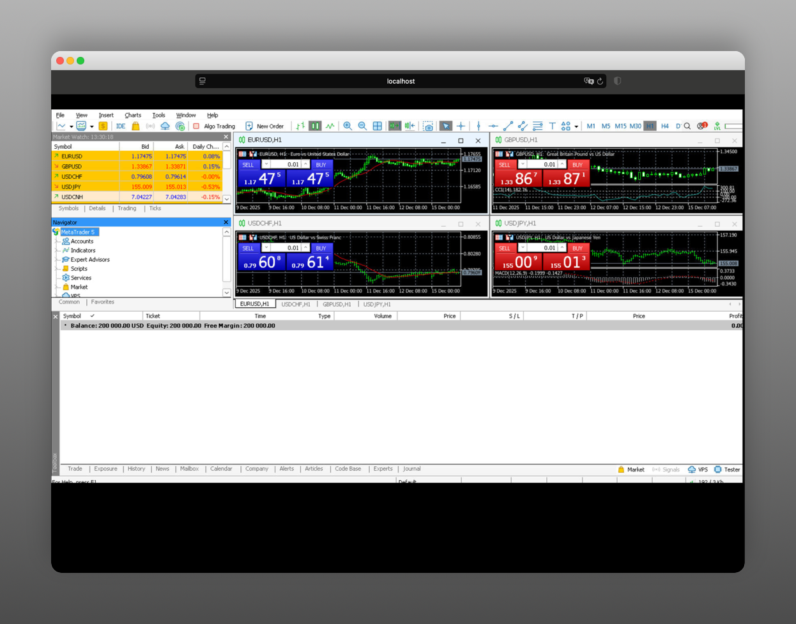
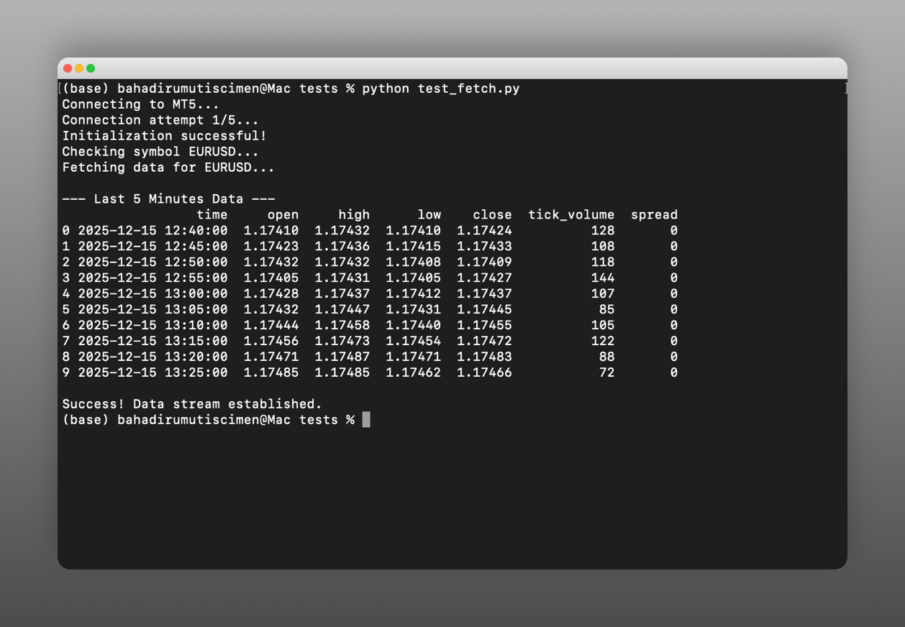

# SiliconMetaTrader5 🍏📈
**MetaTrader 5 Solution for macOS Silicon (M1/M2/M3)**

🇹🇷 **[Türkçe Oku](README_TR.md)**

**Developer:** Bahadir Umut Iscimen

This project is an end-to-end solution developed to run MetaTrader 5 seamlessly on macOS Silicon devices (`docker`) and to perform professional algorithmic trading with Python (`client`).

> [!CAUTION]
> **Important Note on Usage Purpose:**
> This infrastructure is designed to manage your **strategy development, backtesting, and forward-testing** processes with comfort in the macOS environment.
>
> For **Live (Production)** trading that requires milliseconds precision, is critical, or involves high capital, it is recommended to rent a Physical PC or Server with a native Windows infrastructure that does not contain an emulation layer.
---
## 🛑 Challenges Encountered and Solutions
This project is specially designed to overcome the challenges of running x86 applications on macOS Silicon.

1.  **Architecture Mismatch:** Crash issues were solved by using **QEMU** based full x86_64 emulation (Colima) instead of Mac's Rosetta 2.
2.  **IPC Timeout:** Disconnections in Python connections may occur due to the natural slowness of emulation. Therefore, our codes contain special "Retry" mechanisms.
3.  **SSL/TLS:** Secure communication with broker servers was ensured by adding `winbind` and certificate libraries to the Wine environment.
4.  **Chart Independence (No-Chart Data):** Most alternative solutions require adding an indicator (EA) to each pair and keeping that chart open to fetch data. Thanks to the architecture of this project, you can fetch real-time data from any symbol in the background **without the obligation to open charts**, allowing you to scan hundreds of pairs in seconds.
---
## 📂 Project Structure

*   **`docker/`**: Virtualized environment running MT5 (Wine + QEMU).
    *   *The Image used (`bahadirumutiscimen/pysiliconwine`) has been stripped of unnecessary burdens and compiled specifically for this project.*
*   **`client/`**: Python library communicating with MT5 (`siliconmetatrader5`).
    *   *This library has been adapted to solve communication issues of the standard `MetaTrader5` package on macOS Silicon architecture.*
    *   *All functions and command structure remain 100% faithful to the original `MetaTrader5` Python library. You can use your existing codes without changing them.*
*   **`tests/`**: Test files.
    *   *These files are used to verify that the Python library communicating with MT5 is working correctly.*
---
## 🏗 System Workflow Diagram


### 📸 Screenshots
**Running on Localhost (VNC):**


**Python Data Fetching:**


---

## 🚀 Zero-to-Hero Setup

We proceed assuming that nothing is installed on your computer.

### 1. Preparation
Open the terminal and run the following command to install the necessary tools:

```bash
# 1. Install Homebrew (Skip this step if already installed)
/bin/bash -c "$(curl -fsSL https://raw.githubusercontent.com/Homebrew/install/HEAD/install.sh)"

# 2. Install necessary packages:
brew install colima docker qemu lima lima-additional-guestagents
```

### 2. Starting the Engine
We must start Colima with special settings so that Docker can run x86 (Windows) applications on macOS Silicon.

```bash
# Clear old settings if any
colima delete -f

# Start with performant x86 emulation
colima start --arch x86_64 --vm-type=qemu --cpu 4 --memory 8
```

### 3. Installing MT5 Server

```bash
cd docker

# Option 1: Start seeing logs (Recommended - You see if there is a problem)
docker compose up --build

# Option 2: Silent start in background (After system is settled)
docker compose up --build -d
```
*   The process is complete when logs start flowing in the terminal.
*   **Visual Access:** Go to [http://localhost:6081/vnc.html](http://localhost:6081/vnc.html) in your browser (Password: `123456`).
*   **⏳ Be Patient:** Along with the Docker installation phase, the transition from the black screen to the MetaTrader 5 screen (due to initial setup) may take **25-30 minutes**. Please wait without closing it.
*   **First Action:** When MT5 opens on the VNC screen, go to **File > Open an Account**, search for your Broker, and log in manually once.

*(Leave this terminal window open and open a new terminal tab)*

### 4. Installing Python Client

Install the client library we optimized specifically for Apple Silicon (M1/M2/M3) architecture:

```bash
pip install siliconmetatrader5
```

### 5. Testing the Connection

Let's run our sample script to verify everything is working:

```bash
python tests/test_fetch.py 
python tests/test_plot.py
```
*If you see "Connected" or terminal information as output, you succeeded!* 🎉

---

## 📊 Example Usage

Now you can write your own Python bot. Here is a simple example:

```python
from siliconmetatrader5 import MetaTrader5
import pandas as pd

# Connect
mt5 = MetaTrader5(host="localhost", port=8001)

# Fetch Data
print("Fetching EURUSD M15 Data...")
rates = mt5.copy_rates_from_pos("EURUSD", mt5.TIMEFRAME_M15, 0, 100)
df = pd.DataFrame(rates)
print(df.tail())

# Close when done
mt5.shutdown()
```

---

## 🛠 Daily Usage Routine

When you turn off the computer and turn it back on in the morning, here is all you need to do:

1.  **Open Engine:** `colima start` (Remembers settings)
2.  **Start MT5:** `cd docker && docker compose up` (or add `-d` for silent mode)

### 🛑 Stopping and Closing

*   **Stop Only MT5:** `Ctrl+C` (or `docker compose down`)
*   **Close Full System (Frees RAM):** `colima stop`

### ♻️ Resetting (Factory Reset)
If you want to delete everything and start from scratch (All data will be erased!):

```bash
colima delete
colima start --arch x86_64 --vm-type=qemu --cpu 4 --memory 8
```

---

## ⚙️ Advanced Settings (Timezone & Screen)

### 🌍 Changing Timezone
It is set to "Europe/Istanbul" by default. Edit `docker/compose.yaml` to change it:

```yaml
# docker/compose.yaml
environment:
  - TZ=America/New_York  # Or UTC, Asia/Tokyo etc.
```
ℹ️ **World Timezones List:** [Wikipedia Timezone List](https://en.wikipedia.org/wiki/List_of_tz_database_time_zones)

### 🖥 Screen Resolution and Window
Edit `docker/start.sh` to change screen size (currently 1366x768) or open **Window Frames (Openbox)**:

```bash
# docker/start.sh
# Changing Resolution (Line 11)
Xvfb :100 -ac -screen 0 1366x768x24 &

# Frame and Window Management (Line 18)
# openbox &  <-- If you remove the # at the beginning, you can drag windows.
```
*⚠️ **Performance Warning:** Opening the window manager (Openbox) requires additional graphics processing, so it may slightly reduce VNC smoothness (Latency increase).*

*Note: You must reinstall with `docker compose up --build` after these changes.*

## 🛠 Frequently Asked Questions (FAQ)

**Q: I turned off my computer, how do I turn it back on?**
A: Respectively:
1.  `colima start --arch x86_64 --vm-type=qemu --cpu 4 --memory 8`
2.  `cd docker && docker compose up` (You can add `-d` for silent mode)

**Q: How do I stop Docker (MT5)?**
A: You can use the `Ctrl+C` key combination in the running terminal or issue the following command (from another terminal):
`cd docker && docker compose down`

**Q: I only stopped MT5 (Docker), how do I start it again?**
A: If Colima is already running, you have two options:
*   **Quick Start:** If you haven't made any changes to settings (start.sh, Dockerfile etc.):
    `cd docker && docker compose up`
*   **Update Start:** If you changed a setting or are unsure (Recommended):
    `cd docker && docker compose up --build`

**Q: MT5 screen stays black?**
A: Make sure Colima is started in QEMU mode (Command in Step 2).

**Q: Writing Ping n/a / Not Connecting?**
A: Connect via VNC (`http://localhost:6081/vnc.html`), go to `File > Open an Account`, search for your Broker name and log in once.

**Web Interface Password:** `123456`
