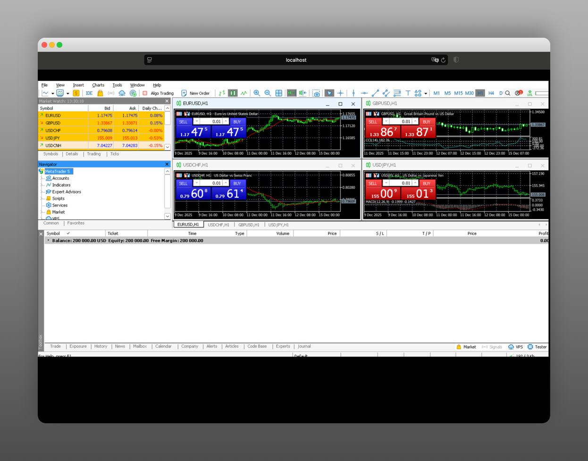
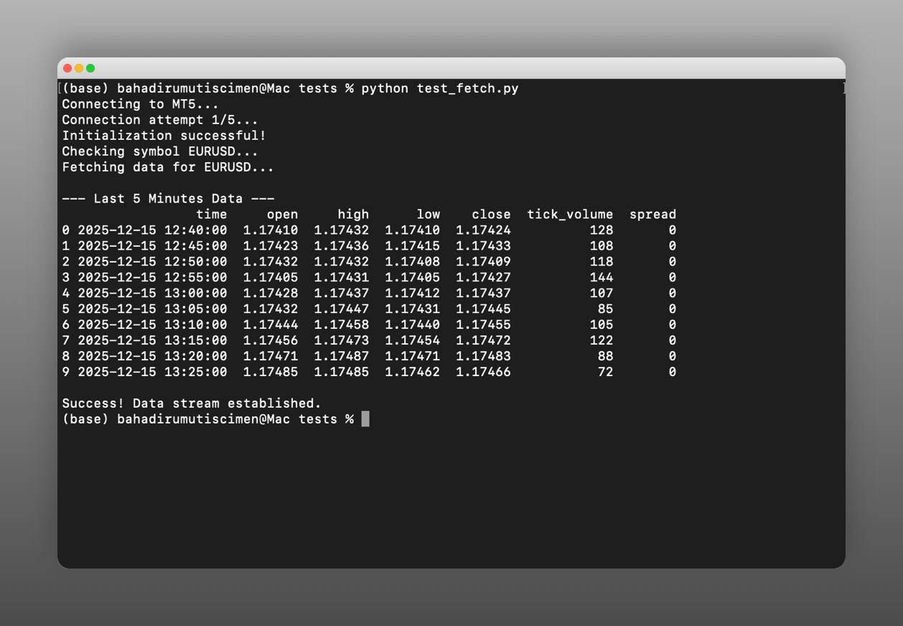

<div align="center">

# ⚡ SiliconMetaTrader5 🍏📈
**Ultimate MetaTrader 5 & Python Solution for macOS Apple Silicon**

[](https://python.org)
[](https://docker.com)
[]()
[]()

**Developer:** Bahadir Umut Iscimen | 🇹🇷 **[Türkçe Oku](README_TR.md)**

---

</div>

> [!NOTE]  
> 💡 **Clarification:** This project does **NOT** replace the native MetaTrader 5 application installed on your computer. It runs a separate, headless MT5 instance via Docker to enable Python communication and algorithmic trading on macOS. This is an end-to-end solution developed to run MT5 seamlessly on macOS Silicon devices and to perform professional algorithmic trading with a Python client.

> [!CAUTION]  
> ⚠️ **Usage Purpose & Production Warning:** This infrastructure is designed to make strategy development, backtesting, and forward-testing incredibly comfortable in the macOS environment. However, for **live (production) trading** that requires millisecond precision or involves high capital, using a physical PC or server with native Windows (no emulation layer) is strictly recommended.

---

## 📦 What's Inside This Repository?

* 🐳 **`docker/`** : High-performance MT5 runtime built on Wine + QEMU.
* 🖥 **`docker_kasm/`** : KasmVNC-based MT5 runtime variant.
* 🐍 **`client/`** : Custom Python client package (`siliconmetatrader5`).
* 🧪 **`tests/`** : Validation and connection health scripts.

---

## 🆕 Release 1.2.3

### KasmVNC Runtime Added
A second runtime variant now exists under `docker_kasm/`. This variant keeps the same `siliconmetatrader5` bridge model and replaces the old `x11vnc + noVNC` desktop layer with KasmVNC.

**Use it from the `docker_kasm/` directory:**
```bash
cd docker_kasm
docker compose down -v
docker compose build
docker compose up
```

**Access:**
* 🌐 **KasmVNC UI:** [http://localhost:3000](http://localhost:3000)

**Important Notes:**
* Build-time installs Wine-side Python, VC runtime, and Python bridge dependencies.
* Runtime installs MetaTrader 5 into the persistent prefix and opens the desktop for first broker login.
* MT5 state, broker login, and downloaded history persist in `/config`.
* Build-time uses `Xvfb` only for Wine installer steps. Runtime GUI is KasmVNC.

### Python Client 1.2.3
`siliconmetatrader5==1.2.3` is the current client version. This release fixes the packaged bridge server layout.

```bash
python3 -m pip install --upgrade siliconmetatrader5==1.2.3
```

---

## 🏗 System Architecture & Workflow

Visualizing the bridge between Apple Silicon, Docker Emulation, and Python.


### 📸 Screenshots
<div align="center">
  
  
  <br>
  <i>Left: Running on Localhost (VNC) | Right: Python Data Fetching</i>
</div>

---

## 📡 Data Retrieval Methods

Choose the right method for your specific trading/backtesting scenario:

| 🎯 Use Case | 🛠 Recommended Method |
| :--- | :--- |
| **Live Monitor / Fresh Bars** | `copy_rates_from_pos()` |
| **Backtest / Historic Data** | `copy_rates_from()` / `copy_rates_range()` |

**Example Implementation:**
```python
# 🟢 Live Data Fetching
live_rates = mt5.copy_rates_from_pos("EURUSD", mt5.TIMEFRAME_M5, 0, 500)

# 🕒 Historical Backtesting
hist_rates = mt5.copy_rates_range("EURUSD", mt5.TIMEFRAME_M5, dt_from, dt_to)
```

---

## 🚀 Zero-to-Hero Setup Guide

Starting from scratch? Follow these steps to get your automated trading engine running on macOS.

### 1️⃣ Preparation
Open your Terminal and install the foundational tools:

```bash
# 1. Install Homebrew (skip if you already have it)
/bin/bash -c "$(curl -fsSL [https://raw.githubusercontent.com/Homebrew/install/HEAD/install.sh](https://raw.githubusercontent.com/Homebrew/install/HEAD/install.sh))"

# 2. Install Emulation & Container required packages
brew install colima docker qemu lima lima-additional-guestagents
```

### 2️⃣ Start the Emulation Engine (Colima)
We configure Colima with **x86_64 emulation** to ensure Docker handles MT5 seamlessly on Apple Silicon.

```bash
# Optional: Reset if Colima state is broken
# colima delete -f

colima start --arch x86_64 --vm-type=qemu --cpu 4 --memory 8
```

### 3️⃣ Initialize the MT5 Server 
```bash
cd docker

docker context use colima

# Option A: Foreground (See live logs - Recommended for first setup)
docker compose up --build

# Option B: Detached (Run in background once stable)
# docker compose up --build -d
```

> [!IMPORTANT]
> **Key Notes for Initialization:**
> * ⏳ **Build Time:** The first build takes roughly **5-10 minutes**.
> * 🖥 **Booting UI:** Transitioning from a black screen to the MT5 interface may take **25-30 minutes** during the very first run.
> * 🌐 **Visual Access:** Go to [http://localhost:6081/vnc.html](http://localhost:6081/vnc.html) .
> * 🔑 **First Action:** Navigate to `File > Open an Account`, search for your broker, and log in manually. 
> * 📊 **Data Sync Warning:** After broker login, historical bars are loaded in the background. Wait **5-10 minutes** before running tests/bots; seeing `No data` in the first minutes is normal. The larger your `MaxBars` value is, the longer this initial sync can take.
> * ⚠️ **Restart Warning:** Even if Colima is running, stopping the container will require you to log in to MT5 again upon restart.

### 4️⃣ Install the Python Client
Link your Python environment to the new Docker instance:
```bash
python3 -m pip install --upgrade siliconmetatrader5==1.2.3
```

### 5️⃣ Verify Connection
Run the built-in tests to ensure smooth data flow:
```bash
python tests/test_fetch.py
python tests/test_plot.py
```
*If your terminal displays a successful connection and outputs data, you are ready to build your bots! 🎉*

---

## ⚙️ Advanced Configuration

### 🌍 Timezone Customization
The default container timezone is `Europe/Istanbul`. To change this, edit `docker/compose.yaml`:
```yaml
environment:
  - TZ=America/New_York  # Options: UTC, Asia/Tokyo, etc.
```
*(Note: This alters the Linux container VNC layer, **not** your broker's server time.)*

### 🖥 Screen Resolution & Performance
Adjust visual settings in `docker/start.sh`:
```bash
# Resolution setup
Xvfb :100 -ac -screen 0 1366x768x24 &

# Window Manager (Optional - May increase VNC latency)
# openbox &
```
*Apply changes:* `cd docker && docker compose up --build -d`

### 📊 MT5 History Depth (MaxBars)
To access deeper bar history for heavy backtesting, edit `docker/mt5cfg.ini`:
```ini
MaxBars=100000  # Options: 5000, 500000, 100000, 250000, 500000, 1000000
```
*(Trade-off: Higher memory usage and slightly slower startup sync.)*

---

## 💻 Example Usage

A quick boilerplate to start fetching data instantly:

```python
import pandas as pd
from siliconmetatrader5 import MetaTrader5

# Initialize Bridge
mt5 = MetaTrader5(host="localhost", port=8001, keepalive=True)

if not mt5.initialize():
    raise RuntimeError("🚨 MT5 initialization failed!")

# Fetch Live Data
rates_live = mt5.copy_rates_from_pos("EURUSD", mt5.TIMEFRAME_M15, 0, 150)
print(pd.DataFrame(rates_live).tail())

# Graceful Exit
mt5.close() 
```

---

## 🆕 Client Updates (Important)

Check your version: `python3 -m pip show siliconmetatrader5`

### 🛠 Core Improvements
1. **Connection Lifecycle (`close` vs `shutdown`):**
   * `close()` disconnects the current process.
   * `shutdown()` completely stops the remote MT5 terminal (Use carefully in multi-bot setups).
2. **Timeout Semantics:** Active per-call timeout is removed. Use `keepalive=True` for long-running bots.
3. **Watchdog Support:** New methods `start_watchdog(...)`, `stop_watchdog()`, and `health_status()` added to detect frozen bridges.
4. **Reliability:** Direct remote call dispatch, normalized error codes (`TIMEOUT`, `CONNECTION_CLOSED`), and `market_book_release` forwarding fixes.

---

## 🛡 Challenges & Architectural Solutions
* **Architecture Mismatch:** Mitigated crash loops by enforcing QEMU-based full `x86_64` emulation instead of Rosetta.
* **IPC Timeout Patterns:** Integrated retry-oriented behavior in the Python client to counter emulation pressure.
* **SSL/TLS Compatibility:** Embedded necessary Windows/Wine dependencies for secure, reliable broker communication.

---

## 🔁 Daily Routine Checklist

**▶️ Start the System:**
```bash
if colima status 2>/dev/null | grep -q "colima is running"; then
  echo "Colima is ready 🟢"
else
  colima start
fi
cd docker && docker compose up -d
```

**⏹ Stop the System Safely:**
```bash
cd docker && docker compose down
colima stop
```

---

## ❓ FAQ (Frequently Asked Questions)

**Q: I rebooted my Mac, what do I run?**
> Run the start script from the repository root. Make sure Colima starts first, then launch Docker compose.

**Q: My MT5 screen stays black via VNC. What do I do?**
> Ensure Colima is running in `QEMU/x86_64` mode. Stop detached mode and run `docker compose up --build` in the foreground to monitor error logs.

**Q: How do I cleanly stop everything?**
> Run `cd docker && docker compose down` and let the containers terminate gracefully before shutting down Colima.

---

## ☕ Support the Project

If this project saves you time or contributes to your trading workflow, you can support it with USDT on the TRC20 network.

**☕ Support via USDT (TRC20)**
```text
TMh8eS5EPRL77Z7L4KhsKmccSNLgf6Rfta
```
---

<div align="center">
  <i>Built with ☕ and code for the Apple Silicon algorithmic trading community.</i>
</div>
